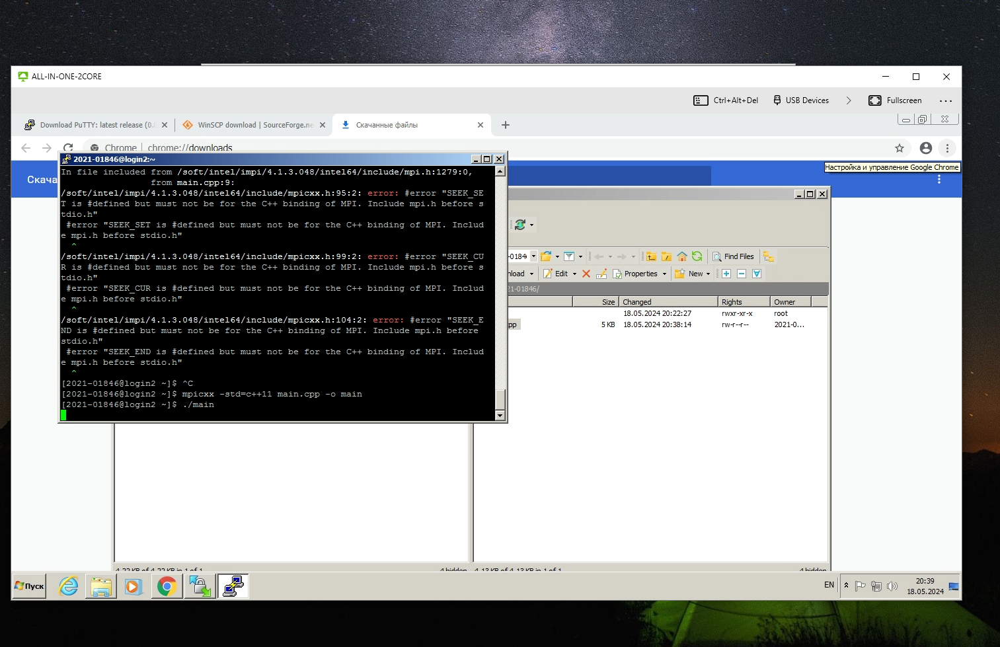
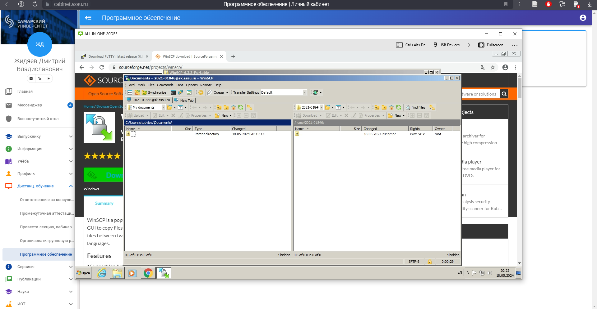
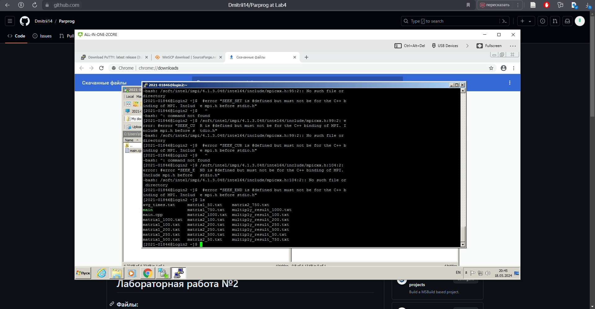

# Лабораторная работа №3

### Файлы:

1. Файл `main.cpp` - файл C++: генерация матриц, выполенение операций перемножения, запись матриц в файлы .txt;
2. Файл `main.py` - файл Python: верификация результатов перемножения, построение графика;
3. Директория `Data`:
    - Текстовый файл `avg_times.txt`: среднее время перемножения матриц различных размеров;
    - Текстовые файлы, содержащие значение матриц различных размеров;
    - Текстовые файлы, содержащие результаты перемножения матриц.
        
### В ходе выполнения данной работы были выполнены следующие шаги:

1. взяты файлы из лабораторной работы номер 2 со всеми исправлениями
2. модификация для параллельной работы по технологии MPI.
3. Произведена работа на суперкомпьютере

### Таблица зависимости среднего время от количества используемых потоков:

. | 1 | 2 | 4 | 8
--- | --- | --- | --- | ---
100 | 19 | 2 | 2 | 2
250 | 309 | 27 | 27 | 19
500 | 2470 | 243 | 256 | 108
750 | 9239 | 1261 | 1285 | 419
1000 | 23671 | 2862 | 2774 | 982

### Работа на суперкомпьютере

1. Подключился по `putty` к суперкомпьютеру.

   
2. Подключился через WinSCP для переброса файла .cpp.

   
3. Загрузил файл с кодом C++ на суперкомпьютер используя ПО WinSCP.
   
4. Проверил через команду ls, что файл загружен и находиться в директории файлов профиля.

5. Загрузил модули необходимые для компиляции проекта.
   
6. Скомпилировал проект через mpicxx.
   
7. Запустил и проверил, что все корректно отработало.

### Вывод:

В ходе данной работы я освоил применение технологии MPI для параллельной обработки задач в программировании на C++, а также научился анализировать результаты вычислений с помощью Python, включая построение графиков и расчет доверительных интервалов. Также был изучен принцип работы с суперкомпьютером, и на практике осуществлен запуск программы на нем.
