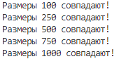
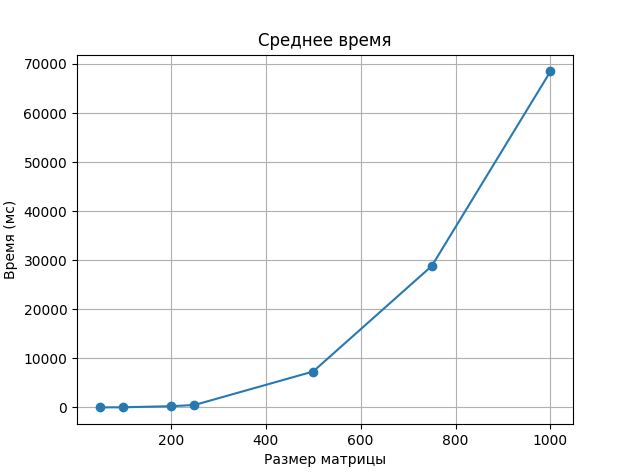

# Лабораторная работа №1

### Файлы:

1. Файл `main.cpp` - файл C++: генерация матриц, выполенение операций перемножения, запись матриц в файлы .txt;
2. Файл `main.py` - файл Python: верификация результатов перемножения, построение графика;
3. Директория `Data`:
    - Текстовый файл `avg_times.txt`: среднее время перемножения матриц различных размеров;
    - Текстовые файлы, содержащие значение матриц различных размеров;
    - Текстовые файлы, содержащие результаты перемножения матриц.
        
### В ходе выполнения данной работы были выполнены следующие шаги:

1. Сгенерировано по 2 матрицы заданного размера
2. Произведено перемножение сгенерированных матриц
3. Сохранены значения сгенерированных и расчитанных матриц
4. Произведен подсчет среднего времени для каждого размера матриц
5. Произведена проверка результатов вычислений
6. Сформирован график зависимости среднего времени расчетов от размеров матрицы

### Верификация вычислений средствами Python:

### График зависимости среднего время от размера матрицы:

### Вывод:

В ходе выполнения данной работы, мы установили, что изменение времени затраченного на перемножение матриц не пропроционально изменению их размеров
